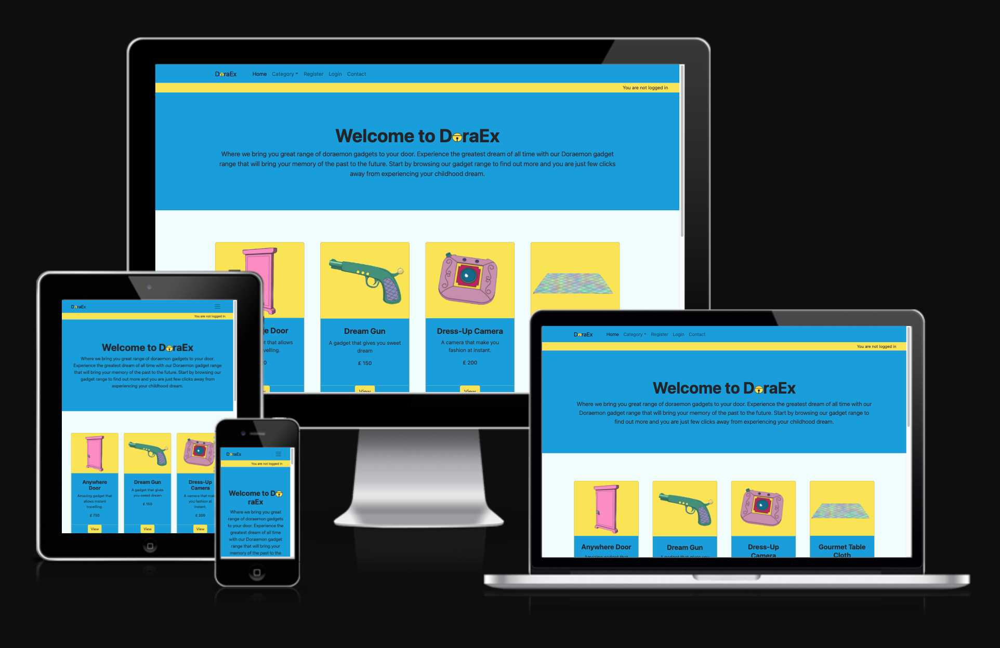
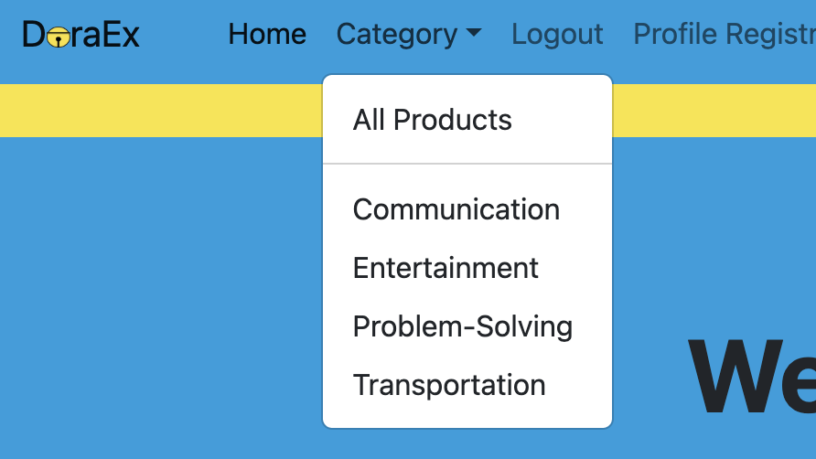

# DoraEx

Experience your childhood dream of trying many of Doraemon genius gadgets that by reading about our app and seeing the gadget already bring nostalgic feeling let alone be able to try using one for real. We have amazing range of gadgets for you to try from simple one like Take-copter and to the very popular one like the Anywhere-door. Your mind will be blown once you try them. Through our app you can browse our gadget range when conveniently rent our gadget that will instantly be delivered to your doorstep thanks to our own Anywhere-Door.

[View DoraEx live website here](https://doraex-app-b88d916586ec.herokuapp.com/)
- - -

## Table of Contents
### [User Experience](#user-experience-ux)
* [Project Goals](#project-goals)
* [Agile Methodology](#agile-methodology)
* [Target Audience](#target-audience)
* [First time user](#first-time-user)
* [Registered user](#registered-user)
* [Admin user](#admin-user)
### [Design](#design-1)
* [Color Scheme](#color-scheme)
* [Wireframes](#wireframes)
* [Data Model](#data-models)
* [User Journey](#user-journey)
* [Database Scheme](#database-scheme)
### [Security Features](#security-features-1)
### [Features](#features-1)
* [Existing Features](#existing-features)
* [Features Left to Implement](#features-left-to-implement)
### [Technologies Used](#technologies-used-1)
* [Languages Used](#languages-used)
* [Databases Used](#databases-used)
* [Frameworks Used](#frameworks-used)
* [Template Used](#template-used)
* [Programs Used](#programs-used)
### [Deployment and Local developement](#deployment-and-local-developement-1)
* [Local Developement](#local-developement)
* [PostgreSQL Database](#postgresql-database)
* [Cloudinary](#cloudinary)
* [Heroku Deployment](#heroku-deployment)
### [Testing](#testing-1)
### [References](#references-1)
* [Docs](#docs)
* [Content](#content)
* [Acknowledgments](#acknowledgments)

---

## User Experience (UX)

Doraemon gadgets brought to your door with few clicks. The range includes most popular gadgets such as Take-copter and Anywhere-door just to name a couple. Through our responsive website your dream of discovering the joy of using these gadgets are very simple. The gadgets are display with Doraemon theme vivid and nostalgic to those who grew up watching the series on TV. Gadget description is very well written and cleared with warning and age restriction guideline for health and safety. The renting process is super simple and enjoyable. With our delivery process made so simple by our Anywhere-door your gadget can be delivered as soon as you confirm your renting for whose who are very keen to try.

### Project Goals

The goal of this project was to create a user friendly website that is intuitive and appealing. The website aim to reintroduce the love of Doraemon and those who have always dreaming about what it would feel like to try some of the very popular gadgets. Renting process had been made very simple with the functionality for user to edit and confirm rent as well as tracking their rent history. Reading about what can each gadget do the info comes with waning and the intended use of each gadgets.

### Agile Methodology

Agile Methodology was used to help prioritize and organize tasks, writting the user stories and using Project Boards on Github. Template was created to help write User Stories.

* User stories were created by identifying what are the require features and functionalities and through iterations the project was advancing.
* Project Board is set to public.
* Project Board was used to track progression of the task through the Todo, In progress and Done columns
* Labels were added to sort the issues based on the importance.

 Project Board

### User Stories

#### User Stories
1. Manage Category list
2. Manage Gadget Lists
3. Create Draft
4. Create view paginated list of gadgets
5. Create view for gadget to display by category
6. Create view to display gadget of interest with detail
7. Manage user sign up and authentication
8. Create rental form for user interaction
9. Manage user profile
10. Create cart to hold rented gadget
11. User can manage rental with CRUD funcitonality

Detailed look can be found in the [project board](https://github.com/users/Whon1980-DL/projects/4/views/1)

### Target Audience

 Individuals who seek the experience of using Doraemon gadgets
* People who are willing to pay a little extra to gain comfort of many ways the gadget can offer.
* People who are in their 40 who are financially settled and can afford the big price of renting and who don't mind paying to try.
* Family who like to have a great fun together with the gadgets and parents who like to introduce Doraemon to their with their children to creating bonding in the family.
* Food reviewers who can just use our gadget to test million kind of food within short time span.
* Family who wants to bring their home content on holiday.

### First time user

* Simple and intuitive website navigation for easy exploration and discovery.
* Engaging visuals showcasing the cleverness of the gadgets and its usage.
* Informative content providing an overview of guideline usage and warning and age restriction.
* User-friendly forms with clear validation messages to ensure accurate input.
* Easy Registration process.

### Registered User

* Seamless login process with a secure and personalized user account.
* Browsing available gadgets
* Renting
* Access to a personalized dashboard displaying renting history and upcoming renting.
* Ability to easily modify or cancel existing renting for flexibility and convenience.

### Admin user

* Access to an admin dashboard for managing customer profile, gadgets and rentings.
* Ability to add, edit, or delete gadget listings, including details and price.
* Managing minumum age usage for appropriate use.
* Ability to delete user accounts, providing the necessary control for managing user data and accounts.
* Management of renting, including the ability to view, modify, or delete rentings as needed.

## Design

DoraEx website brings nostalgic feeling to many people who grew up watching the series and dreamt of one day experiencing the gadgets. Doraemon blue and yellow colour of the bell were use as main theme to associate the hero character to design. The navigation bar features a simple DoraEx word with a touch of an addition of Doraemon iconic bell and easy-to-read text. Clear gadget picture depicting the look of the gadgets with the hero gadget being the first one user will see which is the Anywhere-door. All the form create subtle feeling with the colour usage and simple design. Social media links are presented in the footer to complements the overall design.

### Color Scheme

### Typography

Space Mono is used as the main font throught use of Boostrap ready made template.

### Wireframes

 Home Page on Mobile

 Multiple Pages on Mobile

### Data Models

1. AllAuth User Model
    * Django Allauth, the User model is the default user model provided by the Django authentication system
    * The User entity has a one-to-many relationship with the Renting entity. This means that a User can have multiple Rantings, but each Renting is associated with only one User.
---
2. Category Model
    * Category model associate with gadget model on  many to one basis. More than one gadget can belong to one category
    * This allow gadget to be grouped and makes it easy to browse the gadgets.
---
3. Customer Model
    * Customer model is related to user model on a one-to-one basis which mean one user can only have one customer profile. 
    * The customer in turn is related to gadgets and renting model on a one-to-many basis. Which means one customer can rent many gadget and have many renting. 
    * Admin can edit customer profile in case an id needs to be provided to prove the customer’s age and user can also edit their own profile.
    * The customer model allow customer profile creation for quick booking process as most field in booking form can be autofilled from the customer existing detail in their customer profile and the detail can be edited.
---
3. Gadget Model
    * A Gadget can have multiple Rantings, but each Renting is associated with only one Gadget. This is represented by the foreign key relationship between Gadget and Renting.
    * Admin can add gadget through Django admin panel.
    * Only Admin can change the data in the backend.
    * User can see the gadget information and image based on the chosen gadget.
    * Information provided is price, image, description, intended use, warning and minimum usage age.
---
4. Renting Model
    * A User can have multiple Renting, but each Renting is associated with only one User. This is represented by the foreign key relationship between User and Booking.
    * Renting model has a feature to prevent under age renting thus making it safe.
    * Total price is also calculated in the backend that is then displayed to user to show the total price of the renting, depending on the rent duration and quantity of each gadget rent.
    * Full CRUD functionality is available to the user.
    * User in order to rent has to fill start date, number of day rent and quantity of gadget.
    ---

### User Journey 

### Database Scheme

Entity Relationship Diagram (ERD)

* The Customer entity represents customers that can be associated with renting, with fields id as the primary key. first_name for first name, last_name for last name, age for age and contact detail etc.
* The Category entity represents category to group gadget together with a field of category name.
* The Gadget entity represents individual gadget listings, with fields id as the primary key, name for the gadget's name, description for the gadget's description, price for the gadget's price, image for the gadget's image, minimun_use_age for age restriction, and warning and intended use for customer guideline.
* The Renting entity represents a renting made by a customer for a specific gadget, with fields id as the primary key, gadget as a foreign key referencing the Gadget entity, customer as a foreign key referencing the Customer entity, start_date for the renting start date, end_date for gadget return date, number_days_rent  for rent duration and total_price is calculate using a decorator function.

This data scheme allows for the management of users, customer, category, gadget, and renting. Users can make renting for specific gadgets, and each renting can have associated details such as the start_date, rent duration and quantity of gadget to rent.

## Security Features

### User Authentication

* Django Allauth is a popular authentication and authorization library for Django, which provides a set of features for managing user authentication, registration, and account management.

### Login Decorator

* renting_form, cart, rentign_edit_form,renting_delete and renting_confirm: These views involve operations related to user rentings and require authentication.
* This ensures that only authenticated users can access these views.

### CSRF Protection

* Django provides built-in protection against Cross-Site Request Forgery (CSRF) attacks. CSRF tokens are generated for each user session, and they are required to submit forms or perform state-changing actions. When a user logs out, the session and associated CSRF token are invalidated, making it difficult for an attacker to forge a valid request using a copied URL.

### Form Validation

* The renting_form and renting_edit_form view validates form input using the rentingForm class and rentingEditForm. It checks for various validation errors such as start date, quabity and furation that must not be negatice and datepicker provided for easy date pickin. Past date entering is also screened out and renting will therefor not register if past date is entered. 

### Underage Renting

* If customer wiht age less than the minimum usage age wants to rent teh gdaget the system will block the cusotmer form renting that gadget and not produce booling form when click but an error message instead.

## Features

* Home page showcases images of gadgets with short descriptions.
* User can make an account and login
* When logged in, users get access to the gaget overview and are only able to rent once creating customer profile.
* Users can edit and delete their rentings
* Every user action is accompanied by a corresponding message to ensure that users are promptly notified of any changes or updates.
* Total price of renting is displayed to users in the My Rented Gadget page.

### Existing Features

* Home Page
    * Displays a navigation bar with logo, main heading, category view, paginated gadget view, contact and footer with socials

* Once logged in the Register button change to logout and login change to profile registration. My Rented Gadget and customer profiel icon also appear.

* Logo
    * Logo was made with simple word from the main font with an iconic Doraemon bell.

* Profile Registration
    * If user has yet to create their customer profile, when click on customer registration it will display a form to fill in but if user already have profile created then a message will pop up to day view and edit profile instead.

* Gadget cards
    * As soon as user visit the page they are greet with welcome message and cards of gadgets that depict their attractive short descriptions with price tags. Multiple cards are display on one page to make an impact. User also have an option of viewing by category which help them design what is best what to try. User are allowed to view each gadget in detail once click view.
    * Gadgets are paginated to display 6 gadgets per page

* Gadget View
    * Once click on each card a suer is redirect to a gadget view of the gadget they click. The page display full description, intended usage, warning if any price and age recommedation. Option to start renting will apear if the user already logged in if not the message on rent button will ask the user to log in and create customer profile instead. 

* Footer
    * Contains copyright information, creator and social links.

* Contact Page
    * For educational purposes, the website includes fictional contact information such as an address, phone number, and email. 

* Sign up
    * User can create an account

* Login
    * User can login into an account, if they have created one

* Gadget pagination
    * On the bottom of the page

* Logout
    * User can logout

* Make a Renting
    * Users can make a renting by clicking view button on the gadget they want and then read details and then click rent if already have customer profile then will be able to fill in rent form.
    * Form validation is implemented to make sure form are submitted correctly and if there is an error user will be notified with alert message, also if everything is good, user gets a message to notify them.
    * If user has not already got a customer profile then by clicking rent will redirect use to customer profile registration page and once complete the page will redirect user straight to the rent form of that gadget. Message display to notify successful of customer profile registration. if the user is below the age of minimum usage age a alert message will display and prevent the user from renting.

    

    

* Renting Successful
    * If renting is successful, user gets a notified message and an overview of the renting they just made, which includes all the details and a total price of the renting. The new rent will shows among other rent in the rent history and non-confirmed rent will have delete, edit and confirm buttons.

* Edit Renting
    * User can change their renting and save changes

* Delete Renting
    * User can delete their renting, before it is deleted it has to be confirmed.

* Confirm Renting
    * User can confirm renting whihc will update status inthe backend from pedning to comlete after which no editing can be made and shipping process begin according to start date specified.

* Alert messages
    * For every action there is an alert message to notify user
    * Here is one example

* Admin Features
    * Django built in admin panel allows admin control over the website.
    * Admin can access admin panel by appending /admin to url
    * Can add, update, delete gadgets.
    * Delete accounts and delete rentings...

### Features Left to Implement 

* Features left to implement are outline in the NINTH in the Kanban board and include the following
    * Ability to review gadgets and gives star rating along with being able to edit and delete review for engaging in conversation.
    * Login or sign up using social media account.
    * Ability to fill in form to contact the site owner with reply message stating message received and await response.
    * Ability to verify age through provision of valid ID and age can only be entered by admin and not editable by user.
    * Option to browse gadgets by age recommendation.
    * Search engine with the ability to search keywords and usage.
    * Adding gadget rent count to display as small number next to link to indicate number of rent made.
    * Have models and view to check for gadget inventory and availability
    * For the purposes of this project these implementation were not necessary.

## Technologies Used

### Languages Used

* [HTML5](https://en.wikipedia.org/wiki/HTML5)
* [CSS3](https://en.wikipedia.org/wiki/CSS)
* [JavaScript](https://en.wikipedia.org/wiki/JavaScript)
* [Python](https://en.wikipedia.org/wiki/Python_(programming_language))

### Databases Used

* [PpstgreSQL](https://www.postgresql.org/) - Postgres database
* [Cloudinary](https://cloudinary.com/) - Online static file storage

### Frameworks Used

* [Django](https://www.djangoproject.com/) - Python framework
* [Bootstrap 5.2.3](https://getbootstrap.com/) - CSS framework

### Template Used
* [Startbootstrap](https://startbootstrap.com/template/shop-homepage) 

### Programs Used

* [Github](https://github.com/) - Storing the code online
* [VSCODE](https://code.visualstudio.com/) - To write the code.
* [Heroku](https://www.heroku.com/) - Used as the cloud-based platform to deploy the site.
* [Google Fonts](https://fonts.google.com/) - Import main font the website.
* [Figma](https://www.figma.com/) - Used to create wireframes and schemes
* [LucidChart](https://lucid.app) - Used to draw User Journey and ERD diagram
* [Am I Responsive](https://ui.dev/amiresponsive) - To show the website image on a range of devices.
* [Git](https://git-scm.com/) - Version control
* [ImgeColourPicker](https://imagecolorpicker.com/) - To identify colour of interest form an image.
* [JSHint](https://jshint.com/) - Used to validate JavaScript
* [W3C Markup Validation Service](https://validator.w3.org/) - Used to validate HTML
* [CSS Validation Service](https://jigsaw.w3.org/css-validator/) - Used to validate CSS
* [CI Python Linter](https://pep8ci.herokuapp.com/#) - Used to validate Python
* [Coolors](https://coolors.co/) - Color Scheme

## Deployment and Local Developement

Live deployment can be found on this [View DoraExlive website here](https://doraex-app-b88d916586ec.herokuapp.com/)

### Local Developement

#### How to Fork
1. Log in(or Sign Up) to Github
2. Go to repository for this project [DoraEx](https://github.com/Whon1980-DL/doraex_app)
3. Click the fork button in the top right corner

#### How to Clone
1. Log in(or Sign Up) to Github
2. Go to repository for this project [DoraEx](https://github.com/Whon1980-DL/doraex_app)
3. Click on the code button, select whether you would like to clone with HTTPS, SSH or GitHub CLI and copy the link shown.
4. Open the terminal in your code editor and change the current working directory to the location you want to use for the cloned directory.
5. Type the following command in the terminal (after the git clone you will need to paste the link you copied in step 3 above)
6. Set up a virtual environment (this step is not required if you are using the Code Institute Template in GitPod as this will already be set up for you).
7. Install the packages from the requirements.txt file - run Command pip3 install -r requirements.txt

### PostgreSQL Database
[DoraEx](https://github.com/Whon1980-DL/doraex_app) is using [PostgreSQL](https://www.postgresql.org/) PostgreSQL Database

* The database is online and is provided by Code Institue.
* Account credential is provided and is used through all stages of development to access database.

### Cloudinary
[DoraEx](https://github.com/Whon1980-DL/doraex_app) is using [Cloudinary](https://cloudinary.com/)
1. For Primary interest, you can choose Programmable Media for image and video API.
2. Optional: edit your assigned cloud name to something more memorable.
3. On your Cloudinary Dashboard, you can copy your API Environment Variable.
4. Be sure to remove the CLOUDINARY_URL= as part of the API value; this is the key.

### Heroku Deployment
* Log into [Heroku](https://www.heroku.com/) account or create an account.
* Click the "New" button at the top right corner and select "Create New App".
* Enter a unique application name
* Select your region
* Click "Create App"

#### Prepare enviroment and settings.py
* In your GitPod workspace, create an env.py file in the main directory.
* Add the DATABASE_URL value and your chosen SECRET_KEY value to the env.py file.
* Update the settings.py file to import the env.py file and add the SECRETKEY and DATABASE_URL file paths.
* Comment out the default database configuration.
* Save all files and make migrations.
* Add the Cloudinary URL to env.py
* Add the Cloudinary libraries to the list of installed apps.
* Add the STATIC files settings - the url, storage path, directory path, root path, media url and default file storage path.
* Link the file to the templates directory in Heroku.
* Change the templates directory to TEMPLATES_DIR
* Add Heroku to the ALLOWED_HOSTS list the format ['app_name.heroku.com', '127.0.0.1']

#### Add the following Config Vars in Heroku:

* SECRET_KEY - This can be any Django random secret key
* CLOUDINARY_URL - Insert your own Cloudinary API key
* PORT = 8000
* DATABASE_URL - Insert your own PostgreSQL database URL here

#### Heroku needs three additional files to deploy properly

* python-version
* requirements.txt
* Procfile

#### Deploy

1. Make sure DEBUG = False in the settings.py
2. Go to the deploy tab on Heroku and connect to GitHub, then to the required repository.
3. Scroll to the bottom of the deploy page and either click Enable Automatic Deploys for automatic deploys or Deploy Branch to deploy manually. Manually deployed branches will need re-deploying each time the GitHub repository is updated.
4. Click 'Open App' to view the deployed live site.

Site is now live

## Testing
Please see  [TESTING.md](TESTING.md) for all the detailed testing performed.

## References
### Docs

* [Stack Overflow](https://stackoverflow.com/)
* [Code Institute](https://learn.codeinstitute.net/dashboard)
* [Startbootsratp](https://startbootstrap.com/template/shop-homepage) 
* [Django docs](https://docs.djangoproject.com/en/4.2/releases/3.2/)
* [Django Allauth](https://django-allauth.readthedocs.io/en/latest/)
* [Django and Static Assets](https://devcenter.heroku.com/articles/django-assets)
* [Cloudinary](https://cloudinary.com/documentation/diagnosing_error_codes_tutorial)
* [Google](https://www.google.com/)

### Content

* All of the content is imaginary and written by the developer, Whon1980-DL.
* All images were sources from Doraemon Wiki fan page. 
* [Doraemon Wiki](https://doraemon.fandom.com/wiki/Doraemon)

### Acknowledgments

* I would like to thank my mentor for support and feedback throughout this project, Mitko Bachvarov.
* I would also like to extend my appreciation to the Slack community for their continuous engagement and willingness to share knowledge. The collaborative environment provided a platform for learning, troubleshooting, and gaining inspiration from fellow developers.
* I would like to thank my wife, Nan, for her full support and my two children, Dylan and Logan for being patient with me throughout the development.  
